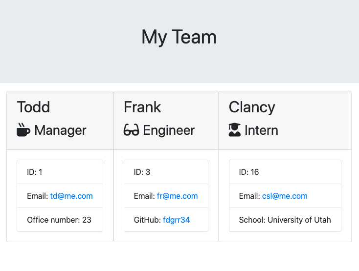

## Employee_resource_manager
  
  ****
  ### Description
  This is a node project that takes in user input and generates an employee information page based on that input. The user will be able to choose the type of employee on their team and set their information. The app is designed for small work teams that need an easy layout of information.

  ### Photo


  ### Table of Contents
  [Installation](#Installation)
  [Usage](#Usage)
  [Licence](#Licence)
  [Contributing](#Contributing)
  [Tests](#Tests)
  [Questions](#Questions)
  [Project Status](#Project-status)
  
  ### Installation
  
  ```
  npm -i
```
  ### Usage
  
  ```
  node app.js
```

  ### License 
  
  ### Contributing
  George Gombert
  ### Tests
  test with jest 

  ```
  npm test 
  ```
  ### Questions or Issues
  If you have any questions or have found issues with the program, please reach out to George
   [Email](georgegombert@gmail.com)
  ### Project Status
  Initial development released. Planned updates are to sharpen the styling of the output and add more functionality to the roster creation. Adding functionality to edit employee information and remove employees from the list is top of the list for that.